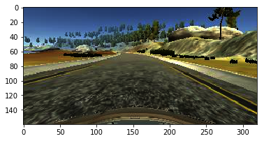
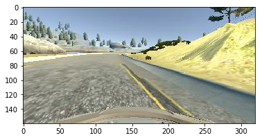
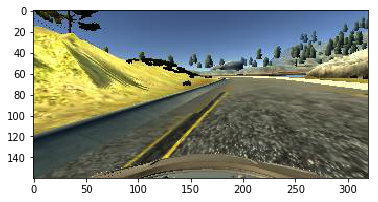

# Behavioral Cloning Project

The goals / steps of this project are the following:
* Use the simulator to collect data of good driving behavior
* Build, a convolution neural network in Keras that predicts steering angles from images
* Train and validate the model with a training and validation set
* Test that the model successfully drives around track one without leaving the road
* Summarize the results with a written report

## Rubric Points
Here I will consider the [rubric points](https://review.udacity.com/#!/rubrics/432/view) individually and describe how I addressed each point in my implementation.  

## Required Files

### Submission includes all required files and can be used to run the simulator in autonomous mode
My project includes the following files:
* model.py containing the script to create and train the model
* drive.py for driving the car in autonomous mode
* model.h5 containing a trained convolution neural network 
* README.md summarizing the results, instead of writeup_report.md

## Quality of Code

### Submission includes functional code
Using the Udacity provided simulator and my drive.py file, the car can be driven autonomously around the track by executing 
```sh
python drive.py model.h5
```

### Submission code is usable and readable
The model.py file contains the code for training and saving the convolution neural network. The file shows the pipeline I used for training and validating the model, and it contains comments to explain how the code works.


## Model Architecture and Training Strategy

### An appropriate model architecture has been employed
My model consists of a convolution neural network with varying filter sizes and depths between 24 and 64. (model.ipynb third cell) 

The model includes ELU layers to introduce nonlinearity , and the data is normalized to values between -0.5 and 0.5 in the model using a Keras lambda layer. 

### Attempts to reduce overfitting in the model

The model contains dropout layers in order to reduce overfitting.  

The model was trained in a large dataset with around 60000 pictures to further insure that it would not overfit. The brightness was always slightly changed on each picture to get more variation.

The model was tested by running it through the simulator and ensuring that the vehicle could stay on the track.

### Model parameter tuning

The model used an adam optimizer, so the learning rate was not tuned manually.

### Appropriate training data

Training data was chosen to keep the vehicle driving on the road. I used a combination of center lane driving, recovering from the left and right sides of the road and driving the track in the opposite direction. Further on every picture was mirrored and the steering angles inverterted, so that an possible uneven distribution between left and right steering is equaled out.

## Architecture and Training Documentation

### Solution Design Approach
The overall strategy for deriving a model architecture was to roughly follow the Nvidia model and from there try different ways to improve the result.

In order to gauge how well the model was working, I split my image and steering angle data into a training and validation set. I found that my first model had a satisfying accuracy of about 98%, but on the road it failed on the first curve. I also noticed that a high accuracy did not mean much in this case. It was easy to reach an accuracy of up to 99% and the car would go off into the wild in the first curve. In other cases an accuracy of 95% was enough to drive half a round.

The first approach to improve the behaviour was to create more training data and train it for more epochs. The car was not staying much longer on the road.

After increasing the depth of the model and the amount of samples. I came to realize that a smaller model with less epochs was enough to succeed the given task. Next to that I tried to balance the amount of steering angles more out by removing two thirds of the zero angle pictures and increase the amount of right angle and let angle pictures by copying.

The final breakthrough came with the strides as low as one or two in all convolutional layers. I think this made it easier for the convolutional network to see every aspect of the picture at hand.

At the end of the process, the vehicle is able to drive autonomously around the track without leaving the road.

### Final Model Architecture

<table>
 <tr>
  <td>Input</td>
  <td>shape: 160x320x3 </td>
 </tr>
 <tr>
  <td>Lambda</td>
  <td>Shape: Normalize range -0.5<=>0.5 </td>
 </tr>
 <tr>
  <td>Cropping</td>
  <td>output: 90x320x3 </td>
 </tr>
 <tr>
  <td >Convolution 5x5</td>
  <td>Stride:2x2, padding:'VALID', output:43x158x24 </td>
 </tr>
 <tr>
  <td>ELU</td>
  <td></td>
 </tr>
 <tr>
  <td> Convolution 5x5</td>
  <td>Stride:2x2, padding:'SAME', output:20x77x32 </td>
 </tr>
 <tr>
  <td>ELU</td>
  <td></td>
 </tr>
 <tr>
  <td>Convolution 5x5</td>
  <td>Stride:3x3, padding:'VALID', output:8x37x48 </td>
 </tr>
 <tr>
  <td>ELU</td>
  <td></td>
 </tr>
 <tr>
  <td>Convolution 3x3</td>
  <td>Stride:1x2, padding:'VALID', output:6x18x64 </td>
 </tr>
 <tr>
  <td>ELU</td>
  <td></td>
 </tr>
 <tr>
  <td>Convolution 3x3</td>
  <td>Stride:1x2, padding:'VALID', output:4x8x64 </td>
 </tr>
 <tr>
  <td>ELU</td>
  <td></td>
 </tr>
 <tr>
  <td>Dropout</td>
  <td>keep:50%</td>
 </tr>
 <tr>
  <td>Flatten</td>
  <td>output:2048</td>
 </tr>
 <tr>
  <td>ELU</td>
  <td></td>
 </tr>
 <tr>
  <td>Fully Connected</td>
  <td>output:100</td>
 </tr>
 <tr>
  <td>ELU</td>
  <td></td>
 </tr>
 <tr>
  <td>Fully Connected</td>
  <td>output:50</td>
 </tr>
 <tr>
  <td>ELU</td>
  <td></td>
 </tr>
 <tr>
  <td>Fully Connected</td>
  <td>output:10</td>
 </tr>
 <tr>
  <td>ELU</td>
  <td></td>
 </tr>
 <tr>
  <td>Fully Connected</td>
  <td>output:1</td>
 </tr>
</table>
### Creation of the Training Set & Training Process

To capture good driving behavior, I first recorded two laps on track one using center lane driving. Here is an example image of center lane driving:


<br>

I then recorded the vehicle recovering from the left side and right sides of the road by driving several rounds going from the right side to the left side, here is a picture on the right side of the road just about to go sharply left.


<br>

To augment the data sat, I also flipped images and angles thinking that this would equal out the tendency of the neural network to steer more in one direction than in the other. For example, here is an image that has then been flipped:


<br>


After the collection process, I had 20,416 data points. I then preprocessed this data by cropping some of the top and the bottom as it seems to be unnecessary for the task at hand.


I finally randomly shuffled the data set and put 10% of the data into a validation set. 

I used this training data for training the model. The validation set helped determine if the model was over or under fitting. I trained the network for 2 epochs which gave me an accuracy of around 5% which is good enough for the task at hand. I used an adam optimizer so that manually training the learning rate wasn't necessary.
